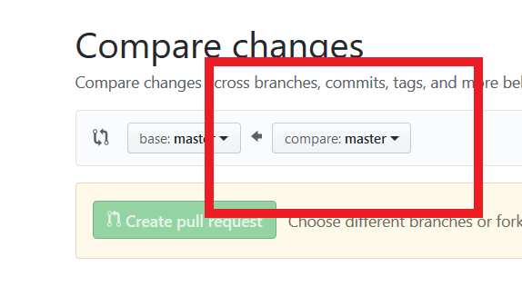
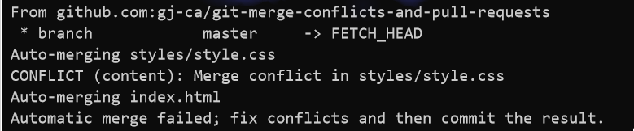

# Checking Out

Lets work on our first feature!

First thing we do is to create a feature branch.

But what branch are we on now?

```bash
$ git branch 
  # * master
```

```bash
```

The asterisk tells us what branch we are on, if we had more branches they would be listed on new lines.

Now we can create that new branch.

```bash
$ git checkout -b new_branch
```

This command will move (checkout) to a new branch (-b) called new_branch which is a copy of the current branch we were working on.

We can confirm this by looking at our branches

``` bash 
$ git branch
  # master
  # * new_branch
```

Right, now we can make some changes. We must always be working on a new branch when we make changes to our code.

First change is to add another paragraph tag inside the `<section id="main-primary">`. This can be anything just make a paragraph tag with some text inside.

Great Work! Now lets add and commit these changes.

```bash
$ git commit -am "Added new parargraph to #main-primary"
```

Now lets make another change. In the .scss file, change the background colour of all `.maintext` sections to anything you like then add and commit this new change as well.

```bash
$ git commit -am "Changed background colour of .maintext"
```

## Pushing up to GitHub

So we're happy with these changes, now what? Lets push this to the remote repository where it is going to be reviewed by our peers and merged into the master branch

```
$ git push origin new_branch
```

Great, now if we go to our [repository](https://github.com/gj-ca/git-merge-conflicts-and-pull-requests) ( <== Click this link), we can see that our changes have been saved online. But the master branch is unchanged, lets have someone review our code.

## Pull Requests

A pull request is a request to merge two branches together, in this case the new_branch we created with the master branch. We can create a pull request by clicking the link to pull requests in the repository.


From there, we can click the green button to create a pull request. Then change the comparison branch to new_branch.




This page shows us all insertions, deletions and any changes that we have made to our code that we want to merge. We can see that next to our branch name (in the red box) that there is a big green tick that says we are able to merge; so far so good now lets click the button below to create pull request.

On the right hand side of the page there is now a list of all collaborators who are able to review our code, right now there isn't much to review but lets select some choice individuals to review our changes before merging. They'll receive an email to review.


## If presenting this to the class as an exercise, the first merge will as instructor will work but subsequent student merges will fail.

## Reviewing & Merging

Now it's time to review someone's code. Generally, we review to ensure our collaborators are following style guides, aren't writing dodgy code and definitely aren't inserting a backdoor into our application for later.

We can see that everything looks good so lets merge it in. I'm going to merge first, that works (students to refresh the page).


## Merge Conflicts 

Now when you try, you should have some difficulty finding the big green button. Thats because there have now been changes made by another collaborator that are not allowing git to automatically merge our changes straight away. We can fix this one of two ways, either in the browser or in our code editor. For simple changes like this we can use the browser but lets see what it looks like on the code editor.

The person who owns this pull request will be the one who fixes their merge conflict, to do this we need to go back to our terminal and into the branch that we are merging.

```bash
$ git branch
  #   master
  # * new_branch
```

So if the problem is that other collaborators new changes on the master branch is conflicting with some of our work we need to get those changes into our current branch. How are we going to get those changes? By pulling them down from the master branch!

```bash
$ git pull origin master
```

As a good habit, we should always be pulling down from master before we push to avoid conflicts. As an example, what if it took us 6 hours to make these changes or we were doing some very complicated work that took long enough for other collaborators work to be merged into master before ours was and now there is code that is conflicting? 

It's our responsibility to resolve these issues before they become a problem for anyone else.

Now that our pull down has finished we can see some interesting things. 




We can see CONFLICT. 


