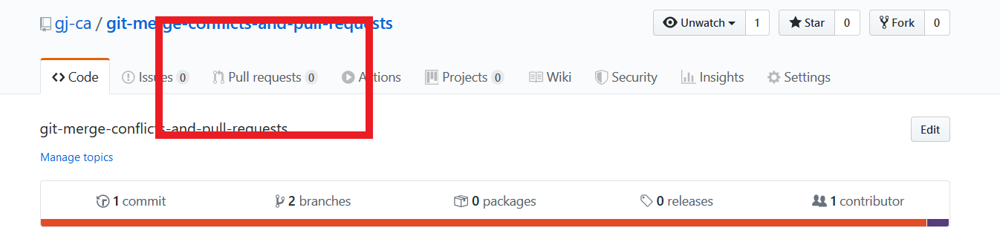

# Checking Out

Lets work on our first feature!

First thing we do is to create a feature branch.

But what branch are we on now?

```bash
$ git branch 
  # * master
```

```bash
```

The asterisk tells us what branch we are on, if we had more branches they would be listed on new lines.

Now we can create that new branch.

```bash
$ git checkout -b new_branch
```

This command will move (checkout) to a new branch (-b) called new_branch which is a copy of the current branch we were working on.

We can confirm this by looking at our branches

``` bash 
$ git branch
  # master
  # * new_branch
```

Right, now we can make some changes. We must always be working on a new branch when we make changes to our code.

First change is to add another paragraph tag inside the `<section id="main-primary">`. This can be anything just make a paragraph tag with some text inside.

Great Work! Now lets add and commit these changes.

```bash
$ git commit -am "Added new parargraph to #main-primary"
```

Now lets make another change. In the .scss file, change the background colour of all `.maintext` sections to anything you like then add and commit this new change as well.

```bash
$ git commit -am "Changed background colour of .maintext"
```

## Pushing up to GitHub

So we're happy with these changes, now what? Lets push this to the remote repository where it is going to be reviewed by our peers and merged into the master branch

```
$ git push origin new_branch
```

Great, now if we go to our [repository](https://github.com/gj-ca/git-merge-conflicts-and-pull-requests) ( <== Click this link), we can see that our changes have been saved online. But the master branch is unchanged, lets have someone review our code.

## Pull Requests

A pull request is a request to merge two branches together, in this case the new_branch we created with the master branch. We can create a pull request by clicking the link to pull requests in the repository.




